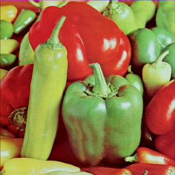

# RLELib: A Library for Lossy RLE (LRLE) compression

[Lossy image compression](#the-compression-algorithm) using *Run Length Encoding* (RLE) with basic [transparency](#transparency-management) support. The [output format](#the-lrle-format) targets easy and fast decompression.

## Credits and citation

* **Author**: Antoni Burguera (antoni dot burguera at uib dot es)
* **Citation**: If you use this software, please cite this repository.

## Contents

  * [Quick start](#quick-start)
    + [Encoding and decoding images](#encoding-and-decoding-images)
    + [Changing threshold and transparency](#changing-threshold-and-transparency)
    + [Displaying images](#displaying-images)
    + [Additional options](#additional-options)
  * [Understanding the system](#understanding-the-system)
    + [The compression algorithm](#the-compression-algorithm)
    + [The LRLE format](#the-lrle-format)
    + [Transparency management](#transparency-management)
    + [The library](#the-library)
  * [Requirements](#requirements)
  * [Disclaimer](#disclaimer)

## Quick start

*RLELib* is Python3 based. Following *Command Line Interface* (CLI) examples are invoked using *python* but, depending on your installation you may have to use *python3* instead.

### Encoding and decoding images

To encode an image with *Lossy Run Length Encoding* (LRLE) use `imconvert.py source_image_path destination_lrle_path` from the command line. The following example encodes the image `IMG/PEPPERS.png` and creates the file `IMG/PEPPERS.bin` with the [LRLE file format](#the-lrle-format).

```console
$ python imconvert.py IMG/PEPPERS.png IMG/PEPPERS.bin
```

To decode an LRLE image use the `-r`. For example, the following command creates the file `IMG/PEPPERS2.png`, which is the PNG version of `IMG/PEPPERS.bin`.

```
$ python imconvert.py IMG/PEPPERS.bin IMG/PEPPERS2.png -r
```

### Changing threshold and transparency

To specify an *Mean Squared Error* (MSE) [threshold](#the-compression-algorithm) instead of using the default value (20), use `imconvert.py source_image_path destination_lrle_path threshold`. This line encodes `IMG/PEPPERS.png` into `IMG/PEPPERS2.bin` using an MSE threshold of 100:

```console
$ python imconvert.py IMG/PEPPERS.png IMG/PEPPERS2.bin 100

```

To use [transparency](#transparency-management) specify the transparent color as an hexadecimal RGB code after the `-t` flag. If no color code is specified after the `-t`, the default color (ff00ff) will be used. To prevent transparency, just do not use the flag. The following example will use pure red (R=FF,G=00,B=00) as transparent color.

```console
$ python imconvert.py IMG/PEPPERS.png IMG/PEPPERS3.bin 100 -t ff0000

```

### Displaying images

To display an LRLE image use *imshow.py path_to_lrle_image*:

```console
$ python imshow.py IMG/PEPPERS.bin 
```

To display images with standard formats use the `-s` flag:

```console
$ python imshow.py IMG/PEPPERS.png -s 
```

### Additional options

Use the `--help` or `-h` flag to see all the available CLI options for `imconvert.py` and `imshow.py`:


```console
$ python imconvert.py --help

usage: imconvert [-h] [-r] [-f] [-d] [-t [TRANSPARENCY]]
                 source_file_name target_file_name [threshold]

Converts an image to an RLE image (RLELib) and vice versa

positional arguments:
  source_file_name      Source file name
  target_file_name      Target file name
  threshold             Maximum MSE in a run. 0 means lossless encoding.
                        Meaningless if --rle option is used (default: 20)

optional arguments:
  -h, --help            show this help message and exit
  -r, --rle             Source image is RLE (default: False)
  -f, --force           Force overwriting if target exists (default: False)
  -d, --display         Display target image (default: False)
  -t [TRANSPARENCY], --transparency [TRANSPARENCY]
                        Transparency (hex string). Do not use it to avoid
                        transparency. Do not specify value to use ff00ff
                        (default: None)

$ python imshow.py --help

usage: imshow [-h] [-s] file_name

Displays an image

positional arguments:
  file_name       Image file name

optional arguments:
  -h, --help      show this help message and exit
  -s, --standard  The image has a standard format (not RLELib format)

```

## Understanding the system

### The compression algorithm

[*Run Length Encoding* (RLE)](https://en.wikipedia.org/wiki/Run-length_encoding) for images is a lossless compression technique that replaces sequences of identical colors, termed *runs*, with a pair involving the color code and the length of the run (called *run length*). This process is highly effective for images featuring extensive areas of uniform color but it tends to be inefficient for images with non-uniform color distributions. In these cases the encoded image may paradoxically occupy more space than the original.

The proposed algorithm does not rely on sequences of identical colors but on sequences of *similar* colors. In this way, it works much better with non-uniform color regions at the cost of being lossy. Similarity between colors is computed in terms of the *Mean Squared Error* (MSE) and deciding whether a color is dissimilar enough to start a new run requires a threshold. The specific details are commented within the `rgb2rle` function in `rlelib.py`.

Given an image, the quality, size and decompression cost of its encoded version are related to the threshold. To exemplify this idea, we encoded an image using thresholds ranging from 0 (so decoding the corresponding LRLE image will produce the exact original image) to 900 in steps of 100. These are the results:


The top left image corresponds to a threshold of 0 (perfect copy of the original image) and the bottom right was generated with a threshold of 900. The resulting quality decreases as the threshold increases.

### The LRLE format

The LRLE format is as follows:

* 2 Bytes - Image width (pixels), big endian.
* 2 Bytes - Image height (pixels), big endian.
* The runs. A run is a horizontal line of pixels of the same color. Each run is:
    - 4 bytes - $BBGGRRCC where BB, GG and RR are the blue, green and red color channels, one byte each. CC is the run length minus one.

Since one of the target uses is low-level, fast, decompression there are format decisions related to that target use:

* Instead of storing run lengths, the run length minus one is used. This can facilitate checking loop conditions in some low-level languages.
* BBGGRRCC format is used for three reasons:
    - Having the CC at the least significant byte may facilitate picking it, depending on the language.
    - BGR color notation is often used in low-level applications.
    - After picking CC, the BBGGRRCC code can be converted either to 00BBGGRR by right-shifting it 8 bits or to BBGGRR00 by masking the least significant byte, thus being easy to build the common low-level formats ABGR and BGRA.
* A run cannot span through several image rows. So, a row data does not start until the previous row data ended. This can slightly increase the file size, but it simplifies the decoding algorithms.
* There are no data terminators.

As an example, let us consider this 4x3 pixels image.


This image would be encoded as follows:

```
0004 0003 0000 ff02 00ff 0000 00ff 0000 ff00 0002 00ff 0003
```

The first two words are width (*$0004*) and height (*$0003*). Then, the first run comes: *$0000 ff02*, which means that the color red (BGR=$0000FF) is repeaded three times (CC=02 means a run length of 3). Afterwards, the second run *$00ff 0000* states that color green (BGR=$00FF00) must be repeated once (CC=0 means a run length of 1). Note how the run does not span through lines: even though the first pixel in the second row has the same color, this run ends here.

The next run, now for the second line, is again *$00ff 0000* since green color must be repeated once. Then, *$ff00 0002* states that blue color (BGR=$FF0000) is to be repeted three times (CC=2 denotes a run length of 3).

Finally, the third image row is represented by a single run, *$00ff 0003*, which means that green color (BGR=$00FF00) must be repeated 4 times (CC=3 means a run length of 4).

Next image shows the previous image with the encoding overlayed.


### Transparency management

This library does not manage an alpha channel neither displays transparency in any way. The transparency parameter just allows to specify one color that must be stored exactly, without any compression. So, if transparency is specified, the *transparent* color will not be affected by compression, but stored exactly as it is in the source image. This means that images LRLE compressed with transparency may be slightly larger than images without transparency.

To exemplify these ideas, let us use this image:


Now, let us compress it with a very large threshold without using the transparency option and then display it. The CLI commands and outputs are:

```console
$ python imconvert.py IMG/GOKU.png IMG/GOKUNT.bin 5000
RLE SIZE: 2632 BYTES.
$ python imshow.py IMG/GOKUNT.bin

```


Now, let us do the same but specifying transparency. The background is magenta with RGB code `ff00ff`. Since this is the default color when using transparency through the CLI, the command could use either `-t` or `-t ff00ff`. Let us use the latter, though both are equivalent:

```console
$ python imconvert.py IMG/GOKU.png IMG/GOKUT.bin 5000 -t ff00ff
RLE SIZE: 3652 BYTES.
$ python imshow.py IMG/GOKUT.bin

```


As it can be observed, in both cases the large compression threshold heavily distorts the image but, if transparency is used, the magenta areas are perfectly preserved. Also, without transparency the LRLE image had a size of 2632 bytes whilst using transparency leads to a size of 3652 bytes.

Neither `imshow.py` nor any of the [library](#the-library) functions to display images (RGB or RLE) do anything with transparency. Transparency is only taken into account when compressing as described before by keeping the specified color exactly as it is, without any compression.

What is the utility of that? When you write your own display code you can be assured that runs with that specified color are exactly as they were in the original image so you can skip them, when plotting, to have the transparency effect.

### The library

Using *rlelib* as a library is useful if you want to use it as part of your own Python code. Otherwise, it is recommended to use the [CLI](#quick-start). The library is provided as a set of functions. There are no objects to instantiate or anything to initialize. Just import the functions you need and use them. These functions are categorized in three groups:

* **Load and save** Comprises functions to load and save from and to disk both RLE images and images with standard formats. The functions are `load_image`, `save_image`, `load_rle` and `save_rle`.
* **Conversion** Contains functions to convert from standard RGB encoding to RLE and vice versa. The functions are `rgb2rle` and `rle2rgb` as well as the auxiliary `rleshape` to obtain the shape of an encoded image without having to convert it to RGB.
* **Visualization** Involves functions to display both standard RGB images and RLE images. The functions are `show_image` and `show_rle`.

All the functions are fully documented in the code. Check the comments in `rlelib.py` for detailed information. Next there are some basic examples.

Let us start by loading and displaying an image using Python:

```python
from rlelib import load_image,show_image
theImage=load_image('IMG/PEPPERS.png')
show_image(theImage)
```

This will show the image:



Conversely, you can display the image using standard libraries, such as:

```python
import matplotlib.pyplot as plt
plt.figure()
plt.imshow(theImage)
```

Let us convert the image to RLE using a [threshold](#the-compression-algorithm) of 100 and no transparency:

```python
from rlelib import rgb2rle
rleImage=rgb2rle(theImage,100,None)
```

The output of `rgb2rle` is a bytearray with [LRLE format](#the-lrle-format). So, you can know its exact size when saved to disk by just examining its length:

```python
print('The RLE image has a size of %d bytes'%len(rleImage))
```

This code will output `The RLE image has a size of 41660 bytes`.

If [transparency is desired](#transparency-management), then just change the `None` by the RGB string of the color to be considered transparent (i.e. ff00ff).


Now you can directly display the encoded version:

```python
from rlelib import show_rle
show_rle(rleImage)
```
You can also convert it to RGB and display it:

```python
from rlelib import rle2rgb
rgbImage=rle2rgb(rleImage)
show_image(rgbImage)
```

Or display the RGB version with standard methods:

```python
plt.figure()
plt.imshow(rgbImage)
```

In all cases, you will see how the RLE image looks like, which is:


To save the RLE image, just do:

```python
from rlelib import save_rle
save_rle(rleImage,'PEPPERS.bin')
```

This will create the file PEPPERS.bin with the LRLE [output format](#the-lrle-format).

You can also save the RGB version of the encoded image in any standard format. Just do:

```python
from rlelib import save_image
save_image(rgbImage,'PEPPERS2.png')
```

Finally, you can load an RLE image and operate with it. For example, the following code loads PEPPERS.bin, converts it to RGB and displays it using *matplotlib*:

```python
from rlelib import load_rle
rleImage=load_rle('PEPPERS.bin')
rgbImage=rle2rgb(rleImage)
plt.figure()
plt.imshow(rgbImage)
```

## Requirements

To use RLELib, the following libraries are required:

* numpy==1.17.4
* Pillow==10.3.0

## Disclaimer
The code is provided as is. While it may run smoothly on your system, there's a slight chance it could cause unexpected outcomes. In rare cases, it might even disrupt the fabric of reality, leading to... well, let's just hope you don't accidentally summon any ancient cosmic entities. So, proceed with care, and if things start to get a bit... Lovecraftian, remember to consult the documentation. If you find yourself facing the abyss, feel free to reach out for assistance.